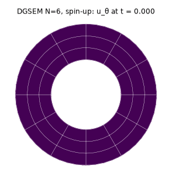
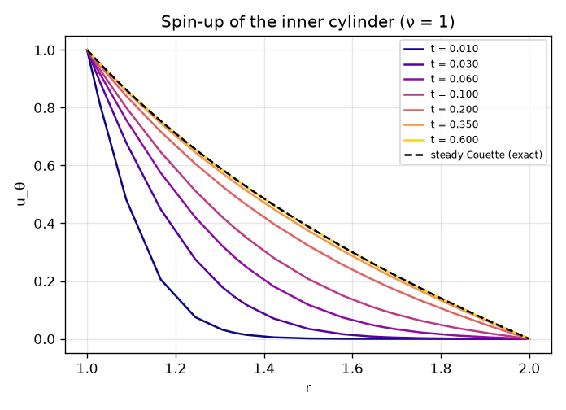
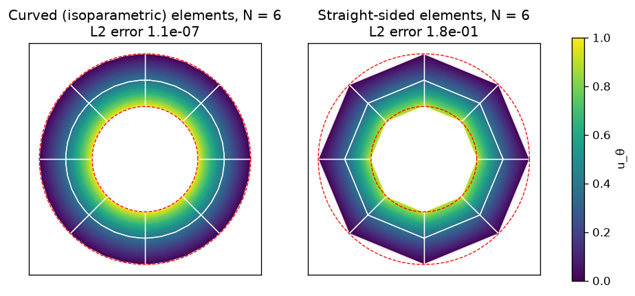
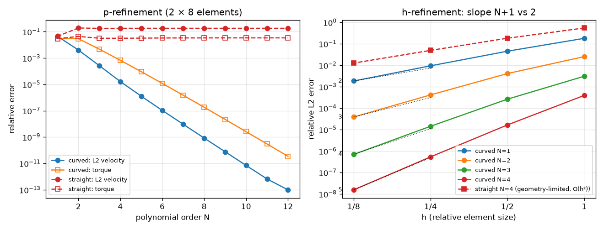

# DGSEM on Curvilinear Elements: Circular Couette Flow

[](https://github.com/cfdgasman/dgsem-couette/actions/workflows/ci.yml)

A nodal **discontinuous Galerkin spectral element method (DGSEM)** on curvilinear quadrilaterals, applied to **circular (Taylor–)Couette flow** between two rotating cylinders. It shows **exponential convergence** on curved, isoparametric elements. It also shows how **straight-sided elements limit accuracy through geometry error**, no matter how high the polynomial order.

<p align="center">


</p>

## Problem

Fluid between r₁ = 1 (rotating, Ω₁ = 1) and r₂ = 2 (at rest). For purely azimuthal, axisymmetric flow the pressure gradient exactly balances the centripetal acceleration. The Cartesian velocity components (u<sub>x</sub>, u<sub>y</sub>) then satisfy

$$ \partial_t \mathbf u = \nu \nabla^2 \mathbf u, \qquad \mathbf u = \boldsymbol\Omega\times\mathbf x \ \text{on the walls}, $$

with the exact steady solution

$$ u_\theta(r) = A r + \frac{B}{r}, \qquad A = \frac{\Omega_2 r_2^2-\Omega_1 r_1^2}{r_2^2-r_1^2},\quad B = \frac{(\Omega_1-\Omega_2)r_1^2r_2^2}{r_2^2-r_1^2}, $$

and torque per unit length |T| = 4πμ|B| on each cylinder.

## Discretisation

### 1. Mesh and curvilinear mapping

The annulus is split into K = K<sub>r</sub> × K<sub>θ</sub> quadrilaterals. Each element is the image of the reference square E = [−1, 1]² under a map **x**(ξ, η):

- **Curved (isoparametric):** at each node, x = r cos θ and y = r sin θ, with r linear in ξ and θ linear in η, so the element edges follow the circles to spectral accuracy.
- **Straight-sided:** the bilinear map through the four corner points, so the walls are polygons.

Every map is interpolated with the same degree-N Lagrange basis as the solution. Its derivatives give the Jacobian and the **contravariant metric terms**

$$ \mathcal J = x_\xi y_\eta - x_\eta y_\xi,\qquad \mathcal J\mathbf a^1 = (y_\eta,\,-x_\eta),\qquad \mathcal J\mathbf a^2 = (-y_\xi,\,x_\xi), $$

and the physical gradient is ∇u = (𝒥**a**¹ ∂<sub>ξ</sub>u + 𝒥**a**² ∂<sub>η</sub>u)/𝒥. Because the metric terms are exact derivatives of a degree-N polynomial map, and the discrete derivatives commute on the tensor grid, the **discrete metric identities**

$$ \partial_\xi(\mathcal J\mathbf a^1)+\partial_\eta(\mathcal J\mathbf a^2)=0 $$

hold to round-off. Without them, a constant or linear state would not be preserved. The test suite checks this.

### 2. Nodal basis and SBP operators

On each element the solution is a tensor-product Lagrange polynomial through the (N+1)² **Legendre–Gauss–Lobatto** nodes:

$$ u(\xi,\eta)=\sum_{i,j=0}^{N} u_{ij}\,\ell_i(\xi)\,\ell_j(\eta). $$

Integrals are evaluated by LGL quadrature on the same nodes (**collocation**), which makes the mass matrix diagonal, M = diag(w). The differentiation matrix D<sub>ij</sub> = ℓ′<sub>j</sub>(ξ<sub>i</sub>) then satisfies the **summation-by-parts (SBP)** property

$$ Q + Q^{\mathsf T} = B,\qquad Q = MD,\quad B=\mathrm{diag}(-1,0,\dots,0,1), $$

the discrete equivalent of integration by parts. This is why the weak and strong forms are algebraically identical and why surface terms reduce to simple end-point corrections scaled by 1/w<sub>0</sub> = 1/w<sub>N</sub>.

### 3. Mixed (first-order) form

The Laplacian is written as a first-order system

$$ \mathbf q = \nabla u, \qquad \nabla^2 u = \nabla\cdot\mathbf q, $$

and both equations are discretised in **strong DGSEM form**. At every node (i, j):

$$ \mathcal J\,\mathbf q_{ij} = \mathcal J\mathbf a^1\,(D u)_{ij} + \mathcal J\mathbf a^2\,(u D^{\mathsf T})_{ij} + \sum_{\text{faces}}\frac{\delta_{\text{face}}}{w_{\text{end}}}\,(u^* - u)\,\hat{\mathbf n}s, $$

$$ \mathcal J\,(\nabla^2_h u)_{ij} = (D\,F^1)_{ij} + (F^2 D^{\mathsf T})_{ij} + \sum_{\text{faces}}\frac{\delta_{\text{face}}}{w_{\text{end}}}\,\big(\mathbf q^*\!\cdot\hat{\mathbf n}s - \mathbf q\cdot\hat{\mathbf n}s\big), $$

where:
- F<sup>1</sup> = 𝒥**a**¹·**q** and F<sup>2</sup> = 𝒥**a**²·**q** are the contravariant fluxes.
- n̂s is the outward normal scaled by the surface Jacobian: ±𝒥**a**¹ on ξ = ±1 and ±𝒥**a**² on η = ±1.
- δ<sub>face</sub> selects the nodes that lie on that face.

### 4. Numerical fluxes

The two elements sharing a face are coupled only through the numerical traces u\* and **q**\*. The code uses **BR1** (Bassi–Rebay) central fluxes with an **interior-penalty** stabilisation:

| | interior face | Dirichlet wall |
|---|---|---|
| u\* | {u} = ½(u⁻ + u⁺) | g = (**Ω** × **x**)<sub>wall node</sub> |
| **q**\*·n̂s | {**q**}·n̂s − η ⟦u⟧ \|n̂s\| | **q**⁻·n̂s − η (u⁻ − g) \|n̂s\| |

Here ⟦u⟧ = u⁻ − u⁺ and η = (N+1)²/h<sub>n</sub>, where h<sub>n</sub> = 2𝒥/|n̂s| is the element height normal to the face. On curved meshes this adjusts automatically for element size and distortion. Pure BR1 has no penalty and can lose stability or accuracy for elliptic problems; the penalty term fixes that without affecting the order of accuracy.

### 5. Linear algebra and time integration

The discrete operator is linear and **affine** in the wall data: ∇²<sub>h</sub>u = A u + c(g). The code applies it to batches of unit vectors (vectorised over elements and the batch dimension) to build A as a sparse matrix. It then solves:
- **steady Couette:** A u = −c(g), by sparse LU, separately for u<sub>x</sub> and u<sub>y</sub>
- **spin-up:** (I − Δt ν A) u<sup>n+1</sup> = u<sup>n</sup> + Δt ν c(g), with backward Euler, factorising once

### 6. Post-processing

- **L2 error** by LGL quadrature, ‖e‖² = Σ<sub>e</sub> Σ<sub>ij</sub> w<sub>i</sub> w<sub>j</sub> 𝒥<sub>ij</sub> |**u**<sub>h</sub> − **u**|²
- **Torque** from the wall traction **t** = −**τ**·**n** with **τ** = μ(∇**u** + ∇**u**<sup>T</sup>) built from the DG gradient **q**; T = ∮ (x t<sub>y</sub> − y t<sub>x</sub>) ds with ds = |n̂s| dη

## Method summary

| | |
|---|---|
| Elements | K<sub>r</sub> × K<sub>θ</sub> quadrilaterals, tensor-product Lagrange basis of degree N on **Legendre–Gauss–Lobatto** nodes (collocation, SBP property) |
| Geometry | **Curved:** nodes on the exact polar map (isoparametric). **Straight:** bilinear map between corners (polygonal walls). Metric terms from the interpolated mapping, so the **discrete metric identities hold exactly** (checked in the tests). |
| Viscous terms | Mixed form q = ∇u, ∇²u = ∇·q in strong DGSEM form; **BR1** central fluxes plus an interior-penalty term (η = (N+1)²/h<sub>n</sub>) |
| Boundary conditions | Rotating-wall velocity **Ω × x imposed at the wall nodes**, so a polygonal wall really does carry a geometry error |
| Linear algebra | Operator assembled as a sparse matrix by batched probing; sparse LU for the steady and implicit (backward Euler) spin-up solves |
| Torque | Wall traction from the DG velocity gradient, integrated with LGL quadrature |

## Results

### Curved vs straight-sided elements

<p align="center"></p>

### Convergence

<p align="center"></p>

**p-refinement** on a fixed 2 × 8 mesh:

| N | curved L2 | curved torque error | straight L2 | straight torque error |
|---|---|---|---|---|
| 2 | 4.09e-03 | 2.95e-02 | 1.91e-01 | 4.37e-02 |
| 4 | 1.65e-05 | 6.76e-04 | 1.81e-01 | 3.19e-02 |
| 6 | 1.06e-07 | 1.19e-05 | 1.82e-01 | 3.33e-02 |
| 8 | 8.40e-10 | 1.83e-07 | 1.82e-01 | 3.38e-02 |
| 10 | 7.04e-12 | 2.58e-09 | 1.82e-01 | 3.40e-02 |
| 12 | **9.77e-14** | **3.43e-11** | 1.82e-01 | 3.40e-02 |

**h-refinement**, observed L2 order between the two finest meshes:

| N | curved | straight |
|---|---|---|
| 1 | 2.35 | 2.35 (identical: both maps are bilinear) |
| 2 | 3.42 | 1.98 |
| 3 | 4.36 | 1.96 |
| 4 | 5.11 | 1.97 |

- **Curved elements** converge **exponentially** in N, reaching 10⁻¹³ with just 16 elements, and at the optimal rate **O(h<sup>N+1</sup>)** under h-refinement. The torque, which depends on the gradient, converges at about O(h<sup>N</sup>).
- **Straight-sided elements** stall at 18 % velocity error and 3.4 % torque error for *any* N. Under h-refinement they converge only at **O(h²)**, the rate at which the polygon approaches the circle. High-order methods need high-order geometry.

### Spin-up

The inner cylinder is started impulsively (backward Euler, Δt = 2×10⁻³, N = 6, 3 × 12 elements). Momentum diffuses outward, and the profile relaxes onto the exact Couette solution over the viscous time scale (r₂ − r₁)²/ν.

## Usage

```bash
pip install -r requirements.txt
python run.py      # tables, figures and GIF in docs/ (~40 s)
pytest             # quadrature, SBP derivative, metric identities, exactness, convergence, torque
```

## References

D. A. Kopriva, *Implementing Spectral Methods for Partial Differential Equations*, Springer, 2009.
F. Bassi, S. Rebay, *A high-order accurate discontinuous finite element method for the numerical solution of the compressible Navier–Stokes equations*, J. Comput. Phys. 131 (1997) 267–279.

## License

MIT
